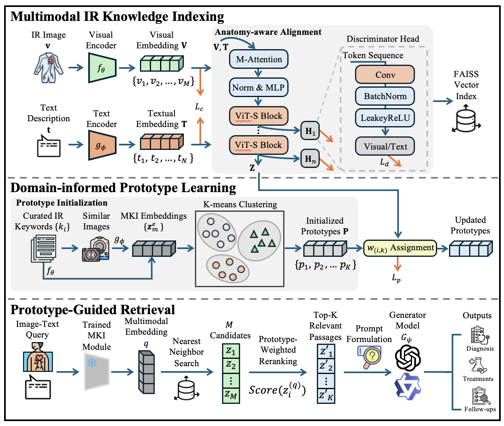

# Prototype-guided Multimodal Retrieval for Knowledge-assisted Interventional Radiology 

The repo presents the core module presented in *Prototype-guided Multimodal Retrieval for Knowledge-assisted Interventional Radiology (PRIMA)*.

## Abstract 
Interventional Radiology (IR) demands integration of diverse information sources, especially imaging data and domain-specific medical knowledge. However, existing Retrieval-Augmented Generation (RAG) frameworks in the medical domain are predominantly text-oriented, limiting their ability to jointly reason over visual and textual evidence essential for IR applications.
To overcome this limitation, we present Prototype-guided Retrieval for Interventional Medical Assistance (PRIMA), a multimodal RAG framework that jointly leverages multimodal imaging and clinical text to support IR decision-making. PRIMA constructs a multimodal knowledge index guided by modality preservation loss that aligns IR related visual–textual knowledge. A set of learnable semantic prototypes is introduced to capture recurrent clinical concepts, enabling prototype-guided retrieval that aligns query intent with relevant radiological evidence. 
Comprehensive evaluations are conducted on literature-curated and clinically collected datasets across retrieval, visual question answering, and human expert evaluations. Experimental results demonstrate that PRIMA substantially outperforms existing RAG baselines in retrieval precision, answer relevance, and interpretability. 



## Repository Layout
- `prima_framework.py`：core modlues of PRIMA
- `train_prima.py`：end2end training script 
- `build_img_text_pair_vector_faissdb.py`：build faiss database 
- `chunk-pdf-files.py`：split PDF into image-text pairs 
- `data/auto.csv`：sample data for locating PMC images

## Environment Setup
We recommend Python 3.10+ 与 PyTorch 2.0+, with `torch`, `torchvision`,`transformers`, `sentence-transformers`,`scikit-learn`, `faiss`, `numpy`, `tqdm`, `Pillow`, `accelerate`


## Training
The training can be invoked by:
```bash
python train_prima.py \
  --train-manifest /path/to/pmc_auto_train.jsonl \
  --prototype-manifest /path/to/prototypes.json \
  --output-dir outputs/prima \
  --vision-model 'vision-model' \
  --text-model 'text-model' \
  --batch-size 8 --epochs 5 --device cuda
```
Key hyperparameters follow the paper: temperature 0.07, modality loss weight alpha=0.7, prototype regularizer beta=0.2, and 80 prototypes.

## Evaluation and Generation
- **Retrieval**: Use MKI to embed queries, run FAISS search, and apply PGR weights to group evidence by semantic prototype.
- **Generation**: Concatenate the query, reranked evidence, and prompt templates before passing them to multimodal LLMs (Qwen2.5-VL-7B, GPT-4o, LLaVA-next, etc.). Metrics include BLEU-4, ROUGE-L, FActScore, and accuracy.
- **Reported gains**: On PMC-Auto, PRIMA achieves BLEU-4 `17.21` and ROUGE-L `31.25`, surpassing MedRAG and other strong RAG baselines. On IR-VQA (open-ended), PRIMA delivers FActScore `42.77` and ROUGE-L `25.43`, with closed-form QA accuracy improvements of up to ~11% for GPT-4o.
